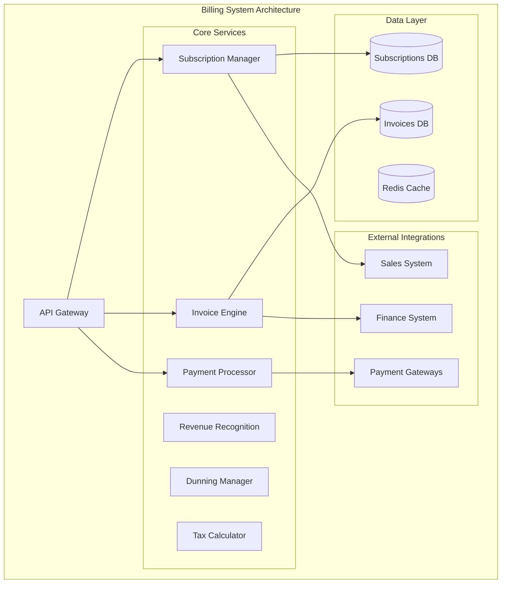

# Subscription Billing and Revenue Management

## Overview

The Subscription Billing and Revenue Management is a comprehensive billing platform for subscription management, invoicing, payment processing, and revenue recognition.

## Purpose and Capabilities

- **Subscription Management**: Plan creation, upgrades/downgrades, prorations, and renewals
- **Invoicing**: Automated invoice generation, customization, and delivery
- **Payment Processing**: Multi-gateway support, retry logic, and fraud detection
- **Revenue Recognition**: ASC 606 compliance, deferred revenue, and financial reporting
- **Dunning Management**: Failed payment recovery, grace periods, and customer communication
- **Tax Calculation**: Global tax compliance, VAT/GST handling, and exemption management
- **Usage-Based Billing**: Metered usage tracking, tiered pricing, and overage charges

## Architecture Diagram



## Tech Stack

### Backend
- **Runtime**: Node.js 20 LTS
- **Framework**: Express.js with TypeScript
- **API**: RESTful + GraphQL
- **Authentication**: JWT with OAuth2.0

### Data Storage
- **Primary Database**: PostgreSQL 15
- **Cache**: Redis 7
- **Message Queue**: RabbitMQ

### Infrastructure
- **Container Orchestration**: Kubernetes
- **CDN**: Cloudflare

### Monitoring
- **APM**: New Relic
- **Logging**: ELK Stack
- **Metrics**: Prometheus + Grafana

## Integration Points

### Upstream Dependencies
- **Sales System**: Deal closures, contract terms, pricing agreements
- **Customer Experience**: Account status, subscription changes, cancellation feedback
- **Product System**: Usage metrics, feature entitlements, product catalog

### Downstream Consumers
- **Finance System**: Revenue data, payment receipts, refunds, and adjustments
- **Sales System**: Commission-eligible revenue, contract renewals
- **Operations**: Provisioning triggers, account suspensions

## Quick Start

```bash
git clone https://github.com/ionoi-inc/billing-system-architect.git
cd billing-system-architect
npm install
cp .env.example .env
npm run migrate
npm run dev
```

## Performance Benchmarks

- Subscription creation: <150ms (p95)
- Invoice generation: <300ms (p95)
- Payment processing: <500ms (p95)
- MRR calculation: <100ms

## Security

- PCI DSS compliance
- Encrypted payment data
- Tokenization
- Fraud detection
- Audit trails

## License

Proprietary - ionoi-inc
